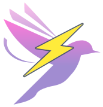

<div align="center">
  <a href="https://versakit.github.io/Versakit-Vue/">
    
  </a>
  <h1>Versakit</h1>
  <p>A modern, highly customizable Vue3 component library</p>
  <p>
    <a href="https://versakit.github.io/Versakit-Vue/">Documentation</a> | 
    <a href="https://versakit.github.io/Versakit-Vue/storybook/">Storybook</a> | 
    <a href="./README.zh-CN.md">中文</a>
  </p>
  <p>
    
    
    
    
  </p>
</div>

---

## 📖 Introduction

Versakit is a carefully designed Vue3 component library aimed at providing highly customizable, headless component solutions. It allows developers to build user interfaces without being constrained by specific visual styles, while providing complete control over the appearance and behavior of components.

## ✨ Features

- 🚀 &nbsp; Provides 30+ high-quality universal components covering forms, navigation, feedback, data display, and more
- 💪 &nbsp; Built entirely on Tailwind CSS, offering elegant default styles with high customizability
- 🎨 &nbsp; Supports headless (unstyled) mode and PT style passing mechanism for flexible component styling
- 🛠️ &nbsp; Supports on-demand importing to optimize application size
- 🌈 &nbsp; Supports theme customization for creating brand-specific UIs
- 🌍 &nbsp; Supports internationalization with built-in Chinese and English language packs
- 💡 &nbsp; Fully developed with TypeScript, providing comprehensive type definitions
- 📚 &nbsp; Detailed documentation and examples for quick onboarding
- 🌙 &nbsp; Native support for dark mode with one-click switching
- ♿ &nbsp; Focus on accessibility design, compliant with WCAG standards

## 📦 Installation

```bash
# Using npm
npm install @versakit/vue

# Using yarn
yarn add @versakit/vue

# Using pnpm
pnpm add @versakit/vue
```

## 🚀 Quick Start

### Full Import

```ts
// main.ts
import { createApp } from 'vue'
import App from './App.vue'
import Versakit from '@versakit/vue'
import '@versakit/vue/style'

createApp(App).use(Versakit).mount('#app')
```

### On-demand Import

```vue
<script setup lang="ts">
import { VButton, VInput } from '@versakit/vue'
import '@versakit/vue/style'
</script>

<template>
	<v-input placeholder="Please enter content" />
	<v-button>Click Button</v-button>
</template>
```

## 🔍 Online Documentation

Check out our [online documentation](https://versakit.github.io/Versakit-Vue/) for more detailed information on component usage, examples, and API references.

## 💻 Local Development

```bash
# Clone the repository
git clone https://github.com/Versakit/Versakit-Vue.git

# Install dependencies
pnpm install

# Start the development server
pnpm dev

# Build the component library
pnpm build

# Run tests
pnpm test
```

## 📄 License

Versakit is licensed under the [MIT License](./LICENSE).

## 🔗 Related Links

- [GitHub Repository](https://github.com/Versakit/Versakit-Vue)
- [Gitee Mirror](https://gitee.com/dragon_water/versakit-ui)
- [Issue Feedback](https://github.com/Versakit/Versakit-Vue/issues)
- [Changelog](./CHANGELOG.md)

## 🤝 Thanks to the Contributors for Their Efforts

<table>
  <tbody>
    <tr><td align="center" valign="top" width="12.5%" style="word-break: break-word; white-space: normal;"><a href="https://github.com/lenran659" title="lenran659"></a></td><td align="center" valign="top" width="12.5%" style="word-break: break-word; white-space: normal;"><a href="https://github.com/Dream-2022" title="Dream-2022"></a></td><td align="center" valign="top" width="12.5%" style="word-break: break-word; white-space: normal;"><a href="https://github.com/ZHuuO" title="ZHuuO"></a></td><td align="center" valign="top" width="12.5%" style="word-break: break-word; white-space: normal;"><a href="https://github.com/ZRMYDYCG" title="ZRMYDYCG"></a></td><td align="center" valign="top" width="12.5%" style="word-break: break-word; white-space: normal;"><a href="https://github.com/Simonmie" title="Simonmie"></a></td><td align="center" valign="top" width="12.5%" style="word-break: break-word; white-space: normal;"><a href="https://github.com/abining" title="abining"></a></td><td align="center" valign="top" width="12.5%" style="word-break: break-word; white-space: normal;"><a href="https://github.com/yyz945947732" title="yyz945947732"></a></td><td align="center" valign="top" width="12.5%" style="word-break: break-word; white-space: normal;"><a href="https://github.com/StriveToLearnCode" title="StriveToLearnCode"></a></td>
    </tr>
    <tr><td align="center" valign="top" width="12.5%" style="word-break: break-word; white-space: normal;"><a href="https://github.com/yuguaa" title="yuguaa"></a></td><td align="center" valign="top" width="12.5%" style="word-break: break-word; white-space: normal;"><a href="https://github.com/xiaotanqingjiao" title="xiaotanqingjiao"></a></td>
    </tr>
  </tbody>
</table>
